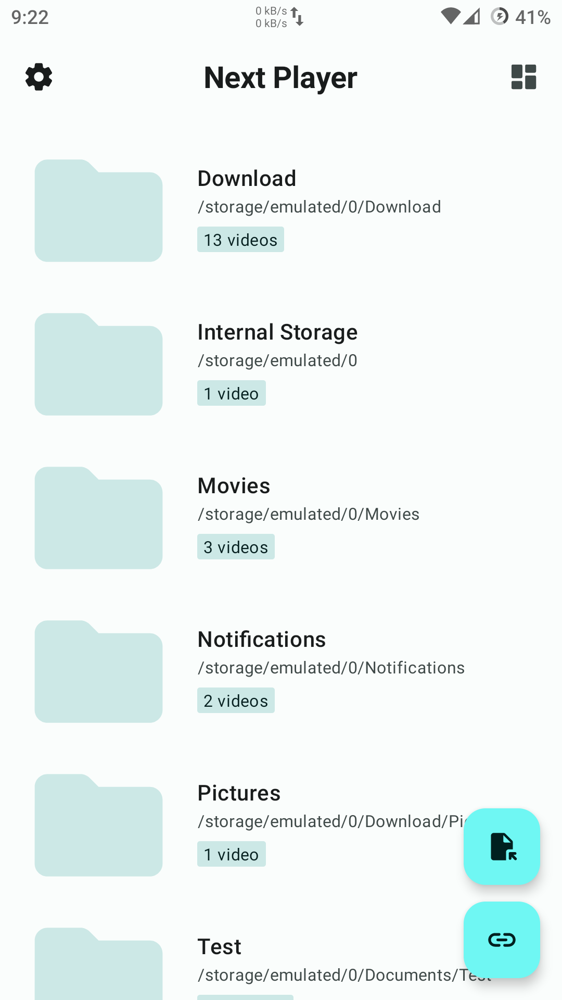

# Flux Player

<p align="center">
  
</p>

<p align="center">
  <strong>A modern Android video &amp; audiobook player based on AndroidX Media3, with built-in danmaku support.</strong>
</p>

---

## ✨ Features

- **🎨 Ink Design** — A neutral grayscale base with 7 accent colour presets and switchable glass / flat surfaces, built with Jetpack Compose and Material 3 expressive motion
- **🎬 Powerful Playback** — Based on AndroidX Media3 (ExoPlayer), supports HLS, DASH, RTSP, and local media files
- **🎧 Audiobook (听书)** — A listening home with local library, online book sources, and recent episodes
  - Local audiobook folder with automatic book detection, cover, chapter list, favourites and resume
  - Book sources in two formats: Timbre **JDR** packages (JavaScript, run on an embedded QuickJS engine) and legacy **JAR** (DEX) sources
  - Netdisk book sources with in-app login (password, cookie, token, QR / WebView) and directory browsing
  - Shared audio and cover disk cache, plus background playback through a Media3 media session
- **💬 Danmaku System** — Custom danmaku (barrage) overlay rendered on a `SurfaceView` driven by `Choreographer` frame callbacks with delta-time animation (design inspired by Bilibili's DanmakuFlameMaster, reimplemented here without linking it):
  - Platform fetchers: Bilibili · Tencent Video · iQiyi · Youku · MangoTV
  - API sources: DandanPlay built-in, plus user-defined sources and local `.xml` / `.json` / `.bilibili` files
- **☁️ Cloud Drive Integration** — Browse and play videos directly from:
  - Aliyun Drive · Quark Drive · UC Drive · 189 Cloud · 139 Cloud (China Mobile) · 123 Pan · WebDAV · OpenList
- **📂 Smart File Browser** — Folder-based video picker with thumbnail generation and metadata parsing
- **🖼️ Picture-in-Picture** — Seamless PiP mode for multitasking
- **🎵 Background Play** — Keep listening with audio-only background playback
- **📝 Subtitle Support** — External subtitle loading with charset auto-detection (juniversalchardet) and manual encoding override
- **⚙️ Highly Customizable** — Adjustable playback speed, danmaku density/opacity/speed, gesture controls, fonts, and more
- **🌐 OpenList Server** — Built-in OpenList service (default port `5244`) that can be started on-device and browsed like any other provider

## 🏗 Architecture

The project follows a clean multi-module architecture — 15 Gradle modules, declared in `settings.gradle.kts`:

```
:app                 Main application module (entry, DI wiring, nav graphs)
:core:common         Shared utilities and extensions
:core:data           Repositories, cloud API clients, danmaku fetchers, OpenList service
:core:database       Room persistence
:core:datastore      Preferences (DataStore)
:core:domain         Domain/use-case layer
:core:media          Media indexing and processing
:core:model          Pure Kotlin data models (no Android dependencies)
:core:ui             Shared Compose components, theme system, caches
:core:tingshu        Audiobook repository, source login/session, resume logic
:core:jdr-engine     QuickJS runtime for JDR book sources (sandboxed HTTP + crypto)
:feature:player      Video player with danmaku overlay, audio playback screen
:feature:tingshu     Audiobook home, player, source management
:feature:settings    App settings
:feature:videopicker File browser & cloud drive picker
```

Key dependency flow: `:app` → `:feature:*` → `:core:data` / `:core:domain` → `:core:database` / `:core:datastore` / `:core:model`, and `:feature:tingshu` → `:core:tingshu` → `:core:jdr-engine`.

## 🛠 Tech Stack

| Category | Technology |
|----------|-----------|
| **Language** | Kotlin 2.3.20 |
| **UI** | Jetpack Compose + Material3 |
| **Player** | AndroidX Media3 1.10.0 (ExoPlayer, media session) |
| **DI** | Hilt (Dagger) + KSP |
| **Database** | Room 2.8.4 + DataStore |
| **Network** | OkHttp 4.12 (Fuel and Jsoup in the audiobook layer) |
| **Serialization** | Kotlinx Serialization |
| **Scripting** | quickjs-kt (JDR book sources), BouncyCastle (source crypto) |
| **Charset** | juniversalchardet (subtitle detection) |
| **Image** | Coil 3.4 |
| **Build** | Gradle KTS + Version Catalog |

## 📦 Build Requirements

- **Android Studio** with the latest AGP (project uses **AGP 9.1.0**)
- **Android SDK** 37 (compile) / 23 (minimum) / 36 (target)
- **JDK** 17+
- **Gradle** 9.4+ (wrapper included)

## 🚀 Getting Started

```bash
# Clone the repository
git clone https://github.com/Ding-DaoDao/fluxplayer.git
cd fluxplayer

# Build debug APK (arm64-v8a only — ABI splits are enabled for APK builds)
./gradlew assembleDebug

# Install to connected device
adb install -r app/build/outputs/apk/debug/app-arm64-v8a-debug.apk

# Style check (ktlint runs on every module and fails the build on violations)
./gradlew ktlintCheck
```

Open the project in Android Studio, sync Gradle, and run on your device or emulator.

## 📚 Guides

Book-source authors will find the API references in [`docs/`](docs):

- [tingshu-jdr-sources.md](docs/tingshu-jdr-sources.md) — JDR manifest, host API, login and directory extensions
- [tingshu-jar-sources.md](docs/tingshu-jar-sources.md) — legacy JAR (DEX) source behaviour
- [pan123-api.md](docs/pan123-api.md), [cloud189-api.md](docs/cloud189-api.md), [yun139-api.md](docs/yun139-api.md) — cloud drive endpoints used by the app

## 📱 Screenshots

<p align="center">
  
  
  
</p>
<p align="center">
  
  
  
</p>
<p align="center">
  
</p>

## 🤝 Credits

Flux Player is built upon the foundation of **[Next Player](https://github.com/anilbeesetti/nextplayer)** by [Anil Beesetti](https://github.com/anilbeesetti).

**Danmaku system** — The multi-platform danmaku source integration is inspired by the [Haikuo Vision (海阔视界)](https://github.com/qiusanshiye/HikerView) danmaku plugin ecosystem, and the renderer follows the design of [DanmakuFlameMaster](https://github.com/bilibili/DanmakuFlameMaster) (reimplemented here, not linked as a library).

**JDR book sources** — The `:core:jdr-engine` module is adapted from **[Timbre](https://github.com/Ding-DaoDao/Timbre/tree/main/core/extension-engine)** (GPL-3.0); see [`core/jdr-engine/NOTICE.md`](core/jdr-engine/NOTICE.md). A sample JDR package lives under `docs/samples/`.

**Third-party Libraries:**
- [AndroidX Media3](https://github.com/androidx/media) — Media playback
- [quickjs-kt](https://github.com/dokar3/quickjs-kt) — JavaScript engine for book sources
- [OkHttp](https://github.com/square/okhttp) — HTTP client
- [Coil](https://github.com/coil-kt/coil) — Image loading
- [Hilt](https://dagger.dev/hilt/) — Dependency injection
- [Room](https://developer.android.com/training/data-storage/room) — Local database
- [juniversalchardet](https://github.com/albfernandez/juniversalchardet) — Charset detection

## 📄 License

```
Flux Player — A Material You video player with danmaku support
Copyright (C) 2024 Flux Player Contributors

This program is free software: you can redistribute it and/or modify
it under the terms of the GNU General Public License as published by
the Free Software Foundation, either version 3 of the License, or
(at your option) any later version.

This program is distributed in the hope that it will be useful,
but WITHOUT ANY WARRANTY; without even the implied warranty of
MERCHANTABILITY or FITNESS FOR A PARTICULAR PURPOSE. See the
GNU General Public License for more details.

You should have received a copy of the GNU General Public License
along with this program. If not, see <https://www.gnu.org/licenses/>.
```

See **[LICENSE](LICENSE)** for full terms.
